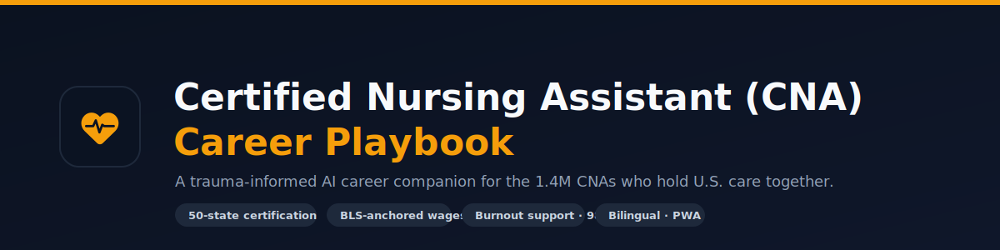

<p align="center">
  
</p>

<h1 align="center">Certified Nursing Assistant (CNA) Career Playbook</h1>

<p align="center">
  A trauma-informed AI career companion for Certified Nursing Assistants — state-accurate
  certification guidance, real wage data, mock interviews, résumé tailoring, and burnout support.
  <br />Built for the people who hold U.S. care on their shoulders.
</p>

<p align="center">
  
  
  
  
  
  
</p>

---

## Why this exists

There are roughly **1.4 million Certified Nursing Assistants** in the United States — a workforce that is overwhelmingly women, disproportionately Black, Latina, and immigrant, paid a median of about **$19/hour**, and burning out fast. CNAs do the hands-on work of care, yet the tools meant to help people *advance* their careers ignore the specifics of the role: state-by-state certification rules, the CNA-to-LPN/RN ladder, scope-of-practice boundaries, and the emotional weight of the job.

This Playbook is built for that gap. It is **not** a generic chatbot wrapper — it's a vertical career companion that combines **state-accurate certification navigation**, **grounded wage and job data**, **interview and résumé practice**, and **genuine burnout support** in one place, in English and Spanish.

> ⚕️ **Not medical advice.** The assistant is a *career* coach. It refuses clinical/medication questions and redirects anything affecting patient safety to a supervising nurse.

---

## What it does

- **🧭 AI career coach (safety-guarded).** Powered by OpenRouter (model-agnostic — OpenAI, Anthropic, Llama, etc., with no vendor lock-in) behind a layered prompt-injection defense, an injection-resistant system instruction, a hard scope-of-practice boundary (no medical advice), and HIPAA-aware handling that declines and redacts protected health information.
- **🗺️ 50-state + DC certification guidance.** A deterministic, rule-grounded dataset — federally-accurate baseline steps (OBRA '87 / 42 CFR §483) for every state, verified specifics where confirmed, and authoritative "verify on your official registry" links everywhere else. **No hallucinated fees or steps.**
- **💵 Real wage data.** Salary benchmarks anchored to U.S. Bureau of Labor Statistics OEWS data and refined with live web-search grounding (OpenRouter `:online`); cached to control cost.
- **🔎 National job search.** Live CNA / patient-care openings via live web-search grounding (no longer region-locked).
- **🎤 Mock interviews & résumé tailoring.** STAR-method behavioral practice and ATS keyword optimization for CNA roles.
- **🔁 Retention loop.** Google / guest sign-in, a cross-device progress dashboard (certification-renewal countdown + quarterly checklist), and reminder notifications — with a local-storage fallback so it works signed-out too.
- **🌎 Bilingual (EN / ES).** Safety-critical strings translated, an in-app language toggle, and the coach replies in the user's language.
- **📲 Installable PWA + offline mode.** Works on a phone with no signal, including static certification guidance and the **988** crisis line.
- **🆘 Burnout support.** Trauma-informed tone with explicit, non-clinical escalation to the 988 Suicide & Crisis Lifeline.

---

## Tech stack & architecture

| Layer | Choice |
|---|---|
| **Front end** | React 19 · Vite 6 · TypeScript · Tailwind CSS 4 (SPA) |
| **Server** | Node · Express (`server.ts`) — being ported to Cloudflare Pages Functions for the edge deploy |
| **AI** | OpenRouter (OpenAI-compatible Chat Completions) — any model via `OPENROUTER_MODEL` (default `openai/gpt-4o-mini`); `:online` adds live web search |
| **Data / Auth** | **Supabase** — Postgres + Row-Level Security + Auth (Google OAuth + anonymous) |
| **Hosting** | **Cloudflare Pages** (static SPA) + **Pages Functions** (the `/api` server) — no Google lock-in |

```
Browser (PWA)  ──►  API server  ──►  OpenRouter (any model + web grounding)
   │  React SPA          │  injection defense · rate limiting · PHI scrubbing · caching · security headers
   │                     └─►  /api/chat · /api/optimize · /api/jobs · /api/salary · /api/states
   └─►  Supabase Auth + Postgres (RLS)  (cross-device profile & progress)
```

---

## Security & compliance

This app is hardened for a consumer (B2C) audience that should **never** enter PHI:

- **Layered prompt-injection defense** on every call (structural + high-signal + context-gated input filter, output validation); injection / prompt-extraction resistance is enforced in our own code, not delegated to the model vendor.
- **PHI/PII scrubbing** — SSNs, card and record numbers are stripped before the model and before any log write; logs are redacted.
- **Denial-of-wallet protection** — per-IP rate limiting + a per-session daily AI quota + response caching.
- **Hardened transport** — CSP, HSTS, `X-Content-Type-Options`, frame options, a request-size cap, and sanitized error responses (no internal details leak).
- **Sound data rules** — Supabase Row-Level Security is deny-by-default and owner-scoped (a user can only read/write their own profile row); the model (OpenRouter) API key and the Supabase service-role key are server-side only and never bundled to the client.

For any use that *does* involve PHI (e.g., a hospital deployment), see **[ENTERPRISE.md](ENTERPRISE.md)** for the HIPAA/BAA tier architecture (per-tenant isolation, customer-managed keys, SSO, audit logging).

---

## Quick start (local)

**Prerequisites:** Node.js 18+

```bash
npm install
cp .env.example .env.local   # then fill in your keys (OpenRouter required; Supabase enables sign-in)
npm run dev
```

Open the printed URL. `npm run dev` runs the API server and the Vite app together. The app runs without Supabase (local-only progress); add the Supabase keys to enable sign-in + cross-device sync.

---

## Build & deploy

```bash
npm run build      # vite build (client) + esbuild (server → dist/server.cjs)
npm start          # NODE_ENV=production node dist/server.cjs  (local prod check)
```

**Deploy → Cloudflare Pages** (connect this GitHub repo in the Cloudflare dashboard → push to `main` auto-builds and ships):
- **Build command:** `npm run build` · **Output directory:** `dist`
- **Server/API:** runs as **Cloudflare Pages Functions** (the `/api` routes), so the secret keys never reach the browser.
- **Secrets (Cloudflare → Settings → Environment variables):** `OPENROUTER_API_KEY`, optional `OPENROUTER_MODEL`, optional Adzuna keys, and the public build vars `VITE_SUPABASE_URL` / `VITE_SUPABASE_ANON_KEY`.

See **[START-HERE.md](START-HERE.md) §4** for the step-by-step Cloudflare deploy and **§5** for the one-time Supabase setup (enable Google + Anonymous sign-in, add your site to the redirect allow-list, run the SQL in `supabase/migrations/`).

---

## Configuration

| Variable | Required | Purpose |
|---|---|---|
| `OPENROUTER_API_KEY` | ✅ | Server-side model access (get one at openrouter.ai/keys) |
| `OPENROUTER_MODEL` | — | Which model to route to (default `openai/gpt-4o-mini`) |
| `VITE_SUPABASE_URL` | — | Supabase project URL — enables sign-in + cross-device sync (public) |
| `VITE_SUPABASE_ANON_KEY` | — | Supabase anon key (public; bounded by Row-Level Security) |
| `SUPABASE_SERVICE_ROLE_KEY` | — | Server-only secret; needed only by the enterprise audit store |
| `ADZUNA_APP_ID` / `ADZUNA_APP_KEY` | — | Live jobs API (free keys at developer.adzuna.com) |
| `APP_URL` | — | Hosted URL (self-links + OpenRouter HTTP-Referer attribution) |
| `NODE_ENV` | — | `production` serves the built `/dist` assets |
| `PORT` | — | Injected by the host (default 8080) |
| `VITE_APP_TIER` | — | `free` (default) · `pro` · `enterprise` feature flags |
| `VITE_PUSH_VAPID_KEY` | — | Enables Web Push background reminders (local reminders work without it) |

---

## Project structure

```
├── server.ts                 # Express API server (OpenRouter, rate limiting, grounding)
├── server/
│   ├── llm/openrouter.ts     # OpenRouter client (chat, model resolution, provider class)
│   ├── security.ts           # headers, rate limiter, PHI scrubbing, error sanitization, cache
│   ├── safety.ts             # model-agnostic system instruction + scope boundary
│   └── stateRequirements.ts  # deterministic 50-state + DC certification dataset
├── src/
│   ├── components/           # UI (Home, Resume, Playbook, Audit, chat, RetentionPanel, …)
│   └── lib/                  # i18n, userProfile (auth/Firestore), notifications, tier flags
├── public/                   # PWA: manifest, service worker, offline page, icons
├── firestore.rules           # owner-scoped security rules
├── START-HERE.md             # plain-language setup, publish & deploy guide
├── CHANGES.md                # technical change log
└── ENTERPRISE.md             # HIPAA/BAA tier architecture
```

---

## Status & roadmap

**Live & build-verified:** AI coach + safety hardening · 50-state certification data · BLS-anchored wages & national jobs · mock interviews & résumé tailoring · accounts + progress dashboard + local reminders · EN/ES · PWA/offline.

**On the path to investment-ready:**
- [ ] Expand verified state specifics beyond the five confirmed states.
- [ ] "New job match" push alerts (stored feed + diff) on top of the existing reminders.
- [ ] Full-screen Spanish coverage + response read-aloud.
- [ ] Clinical-boundary review of the burnout flow by a licensed advisor.
- [ ] Enterprise (BAA) tier build-out — see [ENTERPRISE.md](ENTERPRISE.md).

---

## Accessibility & privacy

Keyboard skip-link, ARIA labelling, 44px touch targets, and an offline crisis resource. The app is designed to avoid collecting protected health information; sample profile data ("Carla Miranda") is illustrative.

## License

© 2026 Certified Nursing Assistant (CNA) Career Playbook. All rights reserved. *(Add a `LICENSE` file before open-sourcing.)*
